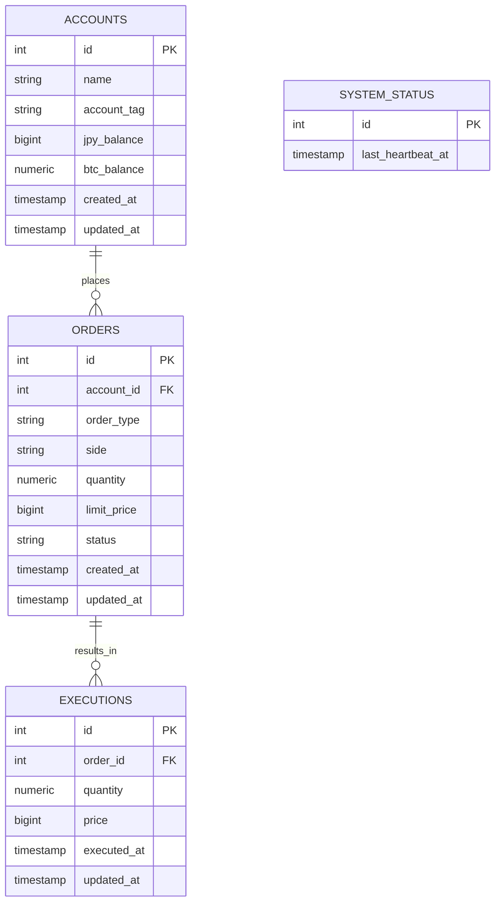

# DB設計（Phase 1スコープ）

## 1. 方針

- 対象スコープ: Phase 1（成行注文のみ）+ 将来の指値注文（Phase 3）を見据えたカラムを一部先取り。テーブル自体の追加・大きな構造変更はPhase 3以降で再検討する。
- ポジション（BTC保有量）は`accounts`に直接カラムを持つ（`jpy_balance` / `btc_balance`）。将来、株・FX等の資産クラスを追加する際は別途`positions`テーブルへの移行を検討する。
- 金額は浮動小数点誤差を避けるため、日本円は`BIGINT`（円単位の整数）、BTC数量は`NUMERIC(18, 8)`を使用する。
- `system_status`以外の全テーブルに`created_at`/`updated_at`を持つ。`updated_at`の自動更新はDBトリガーではなく、アプリケーション側（SQLAlchemyの`onupdate`等）で行う（`docs/architecture.md`の「ロジックをusecase/io層に集約する」方針との一貫性のため）。
- `system_status`は起動・終了時刻の都度記録ではなく、定期的なハートビート（`last_heartbeat_at`の定期更新）方式を採用する。`kill -9`等の異常終了時にも、最後に記録された時刻が実質的な終了時刻とみなせるため、より頑健。更新間隔は実装時（Phase 0/1）に決定する。

## 2. ER図

`system_status`は他テーブルと関連を持たない独立したテーブル。

## 3. テーブル定義

### 3.1 `accounts`（デモ口座）

| カラム名 | 型 | 制約 | 説明 |
|---|---|---|---|
| `id` | `SERIAL` | PK | |
| `name` | `VARCHAR(100)` | NOT NULL | 口座名 |
| `account_tag` | `VARCHAR(20)` | NOT NULL | 用途識別タグ（`human` / `ai`等。FR-014） |
| `jpy_balance` | `BIGINT` | NOT NULL, DEFAULT 0 | 日本円残高（円単位の整数） |
| `btc_balance` | `NUMERIC(18, 8)` | NOT NULL, DEFAULT 0 | BTC保有量 |
| `created_at` | `TIMESTAMPTZ` | NOT NULL, DEFAULT now() | |
| `updated_at` | `TIMESTAMPTZ` | NOT NULL, DEFAULT now() | 残高変動時等にアプリケーション側で更新 |

**補足**:
- `account_tag`はENUM型ではなく`VARCHAR`とし、将来の値追加に備える（FR-014「タグ・メモ等の軽量な属性で良い」に対応）。
- ポジション（`btc_balance`）を`accounts`に直接持つ設計は、将来複数資産クラスに対応する際、別途`positions`テーブルへ移行する拡張ポイントとして意識しておく。

### 3.2 `orders`（注文）

| カラム名 | 型 | 制約 | 説明 |
|---|---|---|---|
| `id` | `SERIAL` | PK | |
| `account_id` | `INTEGER` | NOT NULL, FK → accounts.id | |
| `order_type` | `VARCHAR(10)` | NOT NULL | `market` / `limit` |
| `side` | `VARCHAR(4)` | NOT NULL | `buy` / `sell` |
| `quantity` | `NUMERIC(18, 8)` | NOT NULL | 注文数量（BTC） |
| `limit_price` | `BIGINT` | NULL許容 | 指値の指定価格。`order_type = market`の場合はNULL |
| `status` | `VARCHAR(10)` | NOT NULL | `filled`（Phase 1時点。Phase 3で`pending`/`cancelled`等を追加予定） |
| `created_at` | `TIMESTAMPTZ` | NOT NULL, DEFAULT now() | |
| `updated_at` | `TIMESTAMPTZ` | NOT NULL, DEFAULT now() | ステータス変更時等にアプリケーション側で更新 |

**補足**:
- `limit_price`は「注文時に指定する目標価格」であり、`executions.price`（約定が成立した時点の実勢価格）とは役割が異なる。指値注文では両者が一致しない場合がある（例: 990万円以下で約定の指値に対し、実際の約定価格が989.8万円になる等）。
- `order_type`と`limit_price`の整合性（`market`なら`limit_price`は必ずNULL、`limit`なら必ず値がある）はDBの`CHECK`制約ではなく、アプリケーション側（`*_pure.py`の検証ロジック）でチェックする方針とし、実装の細部として後回しにする。

### 3.3 `executions`（約定履歴）

| カラム名 | 型 | 制約 | 説明 |
|---|---|---|---|
| `id` | `SERIAL` | PK | |
| `order_id` | `INTEGER` | NOT NULL, FK → orders.id | |
| `quantity` | `NUMERIC(18, 8)` | NOT NULL | 約定数量 |
| `price` | `BIGINT` | NOT NULL | 約定価格（実際に取引が成立した価格の正本） |
| `executed_at` | `TIMESTAMPTZ` | NOT NULL, DEFAULT now() | |
| `updated_at` | `TIMESTAMPTZ` | NOT NULL, DEFAULT now() | 通常は更新されない想定だが、他テーブルとの一貫性のため保持 |

**補足**: Phase 1では「成行注文 = 1注文につき必ず1約定」だが、Phase 3で指値注文が複数回に分けて約定するケースを想定し、約定の正規記録は`orders`ではなく`executions`に持たせる。

### 3.4 `system_status`（起動・停止管理）

| カラム名 | 型 | 制約 | 説明 |
|---|---|---|---|
| `id` | `SERIAL` | PK | |
| `last_heartbeat_at` | `TIMESTAMPTZ` | NOT NULL | バックエンド稼働中、定期的に更新される最終生存確認時刻 |

**補足**: Phase 3の停止期間リカバリ（FR-005/FR-006）では、`last_heartbeat_at`の最終値と現在時刻の差分を「停止期間」とみなして使用する。

## 4. 未決事項（実装時に決定）

- ハートビートの更新間隔
- `order_type`/`limit_price`の整合性チェックの実装場所・実装方法の詳細
- 将来、資産クラスを追加する際の`positions`テーブルへの移行方法
