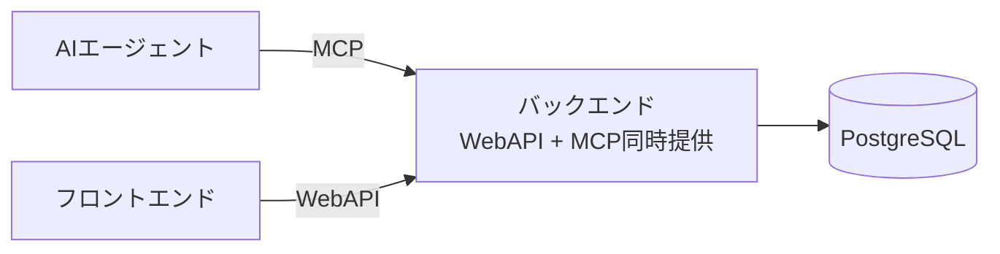
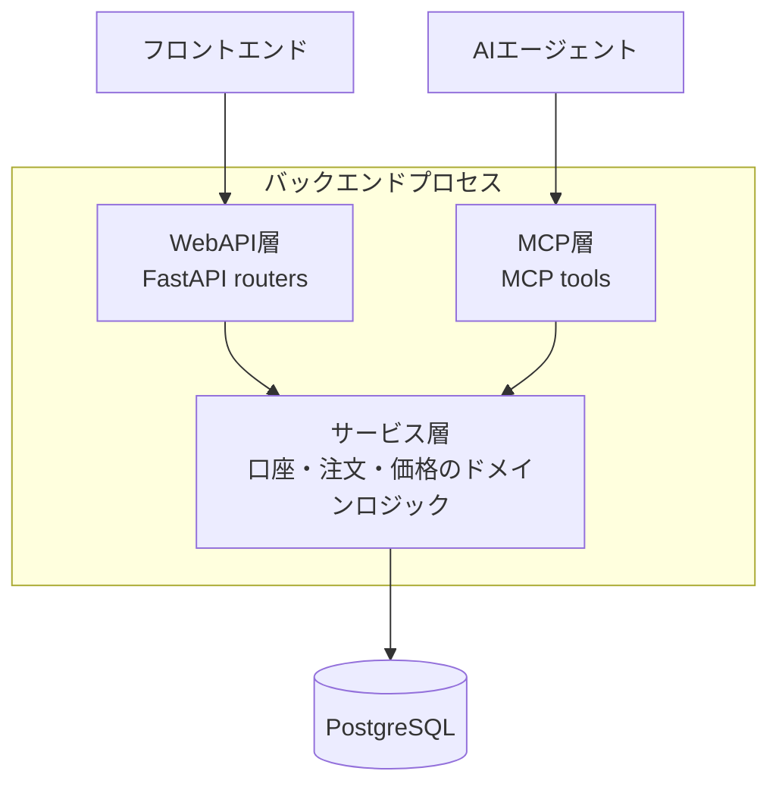
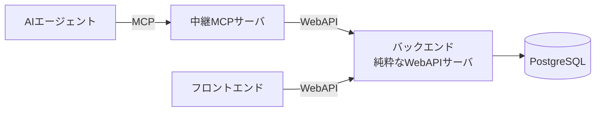

# デモトレードアプリ 要件定義書

## 1. 概要

### 1.1 目的
- 人間がリスクなしに取引を体験できる環境を提供する
- LLM（AI）による取引判断の有効性を検証する場を提供する

### 1.2 アプリ概要
個人用のデモトレードアプリケーション。外部APIから暗号資産（将来的には株・FXも想定）の価格をリアルタイムに取得し、仮想的なデモ口座上で注文・約定をシミュレーションする。Webフロントエンドからの人間の操作と、MCP経由でのAIエージェントからの操作の両方に対応する。

### 1.3 想定ユーザー
- 個人開発者（千葉さん）本人のみ。マルチユーザー機能は対象外。
- 1人のユーザーが複数のデモ口座を作成・管理する（人間検証用1〜2口座、AI検証用1〜2口座のイメージ）。

---

## 2. スコープ

### 2.1 対象とする資産クラス
| フェーズ | 対象 |
|---|---|
| 初期（Phase 1） | 暗号資産 BTC-JPY のみ |
| 将来 | 他の暗号資産、株式、FXへの拡張を想定（データソースアダプタの抽象化により対応） |

**選定理由**: 暗号資産市場は土日含め24時間動いており、開発・検証サイクルが市場休場によって止まらない。株式・FXは将来的な拡張対象として設計上は意識するが、初期実装の対象外とする。

### 2.2 対象としない事項（明示的に対象外）
- マルチユーザー対応・ユーザー認証（ローカル個人利用前提のため）
- 実資金を用いた実取引（本アプリは完全にデモ・シミュレーションのみ）
- 本格的な高頻度取引（HFT）水準の低レイテンシ要求

---

## 3. 機能要件

### 3.1 価格情報取得（バックエンド）
- FR-001: bitFlyer Lightning Realtime API（Public WebSocket）に接続し、BTC_JPYのティッカー情報（`lightning_ticker_BTC_JPY`）をリアルタイムに受信する。
- FR-002: WebSocket接続が切断された場合、自動的に再接続する。
- FR-003: 受信した最新価格を、フロントエンド・MCP・注文監視ロジックそれぞれが参照できる形でバックエンド内に保持する（価格のハブとして機能する）。
- FR-004: 将来、対象資産・データソースを追加できるよう、データソースを抽象化したインターフェース（アダプタ）として実装する。
- FR-005: バックエンドは個人PC上での稼働を前提とし、夜間等に断続的に停止することを想定する。起動時に、前回稼働終了時刻から現在までの間隔（停止期間）を検出する。
- FR-006: 起動時、停止期間中の価格情報を bitFlyer HTTP公開API（約定履歴取得 `GET /v1/getexecutions`）から取得し、停止期間中に存在した未約定注文（指値・OCO・IFD等）の約定判定を一括でリカバリする。
  - 約定履歴は生データ（個々の取引の価格・時刻）のまま使用し、OHLCのような要約データへの変換は行わない（判定精度は厳密でなくてよいため、変換処理自体を実装しない）。
  - 取得した約定履歴を時系列順に走査し、各時点で未約定注文の約定条件を満たすかを順次判定する。
- FR-007: bitFlyerの約定履歴HTTP APIは直近31日分に制限されるため、停止期間が31日を超える場合はリカバリ不可能な期間が生じることを許容する（個人検証用途のため、この制約は受け入れる）。数日程度の停止を主な想定範囲とする。

### 3.2 デモ口座管理
- FR-010: デモ口座を新規作成できる（初期資金額を指定）。
- FR-011: デモ口座を削除できる。
- FR-012: デモ口座を複数同時に保持・管理できる。
- FR-013: 各デモ口座は名称・初期資金・現在の残高・作成日時を持つ。
- FR-014: 口座ごとに、人間操作用／AI操作用といった用途を識別できるようにする（タグ・メモ等の軽量な属性で良い）。

### 3.3 注文・約定シミュレーション
- FR-020（Phase 1）: 成行注文（買い・売り）を受け付け、注文受付時点の最新価格で即時約定させる。
- FR-021（Phase 2）: 指値注文を受け付け、価格が指定条件を満たした時点で約定させる。未約定の指値注文を継続的に監視する仕組みを持つ。バックエンド起動時には、FR-006のリカバリ処理により、停止期間中の価格変動を反映した約定判定を行う。
- FR-022（Phase 3）: OCO注文（指値+ストップ等の組み合わせ、一方が約定したら他方をキャンセル）に対応する。
- FR-023（Phase 3）: IFD注文（親注文の約定をトリガーに子注文を自動発行）に対応する。
- FR-024: 約定時、口座残高・保有ポジションを更新する。
- FR-025: 注文のキャンセル（未約定注文の取消）ができる。

### 3.4 データ永続化
- FR-030: デモ口座の残高・保有ポジションをDB（PostgreSQL）に保存する。
- FR-031: 注文履歴（発注・キャンセル・約定状況）をDBに保存する。
- FR-032: 約定履歴をDBに保存する。
- FR-033: アプリ再起動後も、口座状態・履歴が保持される。

### 3.5 フロントエンド（人間用UI）
- FR-040: 現在の価格（BTC-JPY）をリアルタイムに表示する。
- FR-041: デモ口座を選択し、注文（成行・将来的に指値等）を行う画面を提供する。
- FR-042: デモ口座の新規作成・削除をUIから行える。
- FR-043: 口座ごとの成績（損益・取引履歴等）を確認できるダッシュボードを提供する。

### 3.6 MCPサーバ（AI用インターフェース）
- FR-050: AIエージェントが現在価格・口座情報を取得できるツールを提供する。
- FR-051: AIエージェントが注文（成行、将来的に指値等）を発行できるツールを提供する。
- FR-052: AIエージェントが自身の操作対象の口座の状態（残高・ポジション・履歴）を取得できるツールを提供する。

---

## 4. 非機能要件

### 4.1 アーキテクチャ
- NFR-001: バックエンドはPythonで実装し、Webフレームワークとして FastAPI を使用する。
- NFR-002: データベースは PostgreSQL を使用する。
- NFR-003: MCPサーバは、バックエンドプロセスが直接MCPプロトコルを提供する構成（構成A）とする。ただし将来的に中継MCPサーバ（構成B）へ移行しやすいよう、ビジネスロジックをMCP層から分離し、サービス層に集約する設計とする。
  - サービス層（口座操作・注文処理・価格取得などのドメインロジック）は、WebAPI層・MCP層のどちらからも同じ関数/クラスを呼び出す形にする。
  - MCP層・WebAPI層は、サービス層への「薄いラッパー」として実装する。
  - 構成A・Bの詳細な比較、構成図は「付録A. MCPサーバ構成（構成A / 構成B）の詳細」を参照。
- NFR-004: フロントエンドは React を採用する。技術スタックの詳細は「5. 技術スタック（確定事項）」を参照。

### 4.2 認証・セキュリティ
- NFR-010: ユーザー認証は実装しない（ローカル個人利用前提）。
- NFR-011: 外部APIキー（将来FX等を追加する際に必要になるもの）は環境変数等で管理し、コード・DBにハードコードしない。

### 4.3 可用性・信頼性
- NFR-020: WebSocket接続断時は自動再接続を行い、再接続までの間は直前の価格を保持してフォールバックする。
- NFR-021: 価格データソースのメンテナンス等による一時的な切断は許容する（個人検証用途のため高可用性は必須要件ではない）。
- NFR-022: バックエンドは個人PC上での断続的な起動・停止（夜間停止等）を前提とした設計とする。停止前の状態（口座・注文）はDBに永続化されているため、再起動時にそのまま復元できる。
- NFR-023: 起動時の停止期間リカバリ処理（FR-006）は、bitFlyerのAPIレート制限に抵触しないよう、ページング間隔を調整しながら実行する。

### 4.4 拡張性
- NFR-030: 価格データソース（取引所・資産クラス）を追加する際に、既存の注文・口座管理ロジックへの影響を最小化できるよう、データソース層を抽象化する。
- NFR-031: 注文種別（成行→指値→OCO/IFD）を追加する際に、既存の注文処理フローを大きく壊さないよう、注文の状態遷移をモデル化する。

---

## 5. 技術スタック（確定事項）

| レイヤ | 技術 |
|---|---|
| バックエンド言語 | Python |
| Webフレームワーク | FastAPI |
| データベース | PostgreSQL |
| 価格データソース（リアルタイム） | bitFlyer Lightning Realtime API（Public WebSocket, `lightning_ticker_BTC_JPY`） |
| 価格データソース（停止期間リカバリ用） | bitFlyer HTTP公開API（約定履歴取得 `GET /v1/getexecutions`、直近31日分まで取得可能） |
| MCP実装方式 | バックエンドが直接MCPサーバとして動作（将来構成Bへの移行を見据えたサービス層分離） |
| フロントエンド フレームワーク | React |
| ビルドツール | Vite |
| クライアント状態管理 | Zustand（UIのローカル状態） |
| サーバ状態管理 | TanStack Query（API由来データの取得・キャッシュ・再フェッチ） |
| UIコンポーネント | shadcn/ui |
| フォーム | React Hook Form + Zod（注文フォームのバリデーション） |
| チャート | Recharts または lightweight-charts（Phase 5のダッシュボードで選定） |
| ルーティング | React Router |
| 日時操作 | date-fns |

---

## 6. 未確定・今後検討する事項

- フロントエンドへの価格配信方式（WebSocket購読 or ポーリング）
- チャートライブラリの最終選定（Recharts or lightweight-charts、Phase 5実装時に判断）
- 指値監視の実装方式（DB走査によるポーリング型 or イベント駆動型）
- 口座属性（人間用／AI用の識別方法）の具体的なデータモデル
- 将来、株・FXを追加する際の具体的なデータソース選定

---

## 付録A. MCPサーバ構成（構成A / 構成B）の詳細

NFR-003で採用した「構成A」と、将来の移行先として想定する「構成B」について、それぞれの構成図とメリット・デメリットを示す。

### 構成A：バックエンドが直接MCPサーバとして動作（採用）

サービス層（口座操作・注文処理・価格取得などのドメインロジック）を中心に置き、WebAPI層とMCP層がそれぞれサービス層を呼び出す薄いラッパーとして実装される。

**メリット**
- シンプル。サーバが1つで済み、デプロイ・運用コストが低い。
- DBアクセスやビジネスロジックを2回実装しなくて良い。
- 個人開発・デモ用途としては十分な構成。

**デメリット**
- バックエンドのプロセス内にMCPプロトコル処理が混在し、責務が肥大化する。
- 将来的に「複数のバックエンド（株用・FX用など）を1つのAIから使わせたい」となった時、AIから見るMCPの窓口が分散する。
- WebAPIとMCPで認証・レート制限の考え方が違う場合、同じサーバ内で両方を意識した設計が必要になる。

### 構成B：中継MCPサーバを別途用意（将来の移行先）

バックエンドはWebAPIサーバという単一責務に専念し、フロントエンドも中継MCPサーバも対等にWebAPIのクライアントとして振る舞う。

**メリット**
- バックエンドは「WebAPIサーバ」という単一責務に専念できる。フロントエンドもMCPサーバも対等にWebAPIのクライアントとして扱える、という綺麗な設計になる。
- 中継サーバ側でAI向けの「使いやすいツール定義」（例: 価格取得+簡易分析をまとめた1コールのツール）を自由に作れる。バックエンドAPIの粒度とAIに見せるツールの粒度を分離できる。
- 将来、同じバックエンドを別のMCPサーバ実装（例: 別言語、別AIプラットフォーム向け）に差し替えたり並存させたりしやすい。

**デメリット**
- サーバが2つになり、開発・デプロイ・デバッグの手間が増える（個人開発だとこれは結構効いてくる）。
- 中継サーバ経由のレイテンシが一段増える（デモトレードなら通常は無視できるレベル）。
- 最初から2サーバ構成を保守するのは、最小機能から始める本プロジェクトの方針とズレる可能性がある。

### 採用判断と移行条件

現時点では構成Aを採用する。本プロジェクトの性質（個人開発・段階的拡張・最初は最小機能）に合致するため。

ただし、以下のような状況が生じた場合は構成Bへの移行を検討する。
- AIに見せたいツールの粒度と、WebAPIのエンドポイント粒度がずれてきた（例: AI向けに複数APIを束ねた複合ツールが欲しくなった）
- 複数のバックエンド（株用・FX用等）を1つのMCP窓口からAIに使わせたくなった
- MCP層とWebAPI層で求められる認証・レート制限の方式が大きく異なってきた

構成Aの実装時点でビジネスロジックをサービス層に集約しておくことで、移行時にはMCP層（薄いラッパー部分）を新しい中継サーバ側に移し替えるだけで対応できる設計とする。
